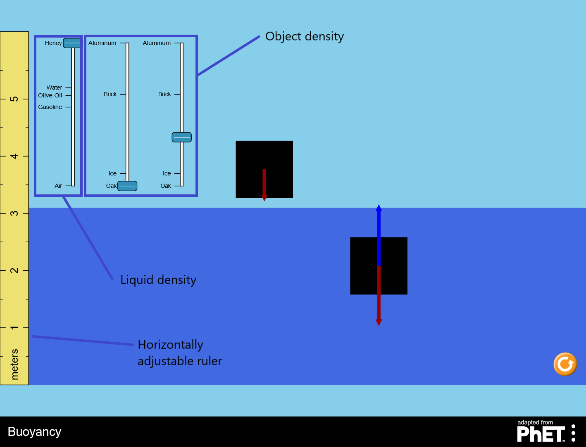

Buoyancy
================

Because my AP Computer Science A professor also taught physics, I designed this interactive PhET lab according his desired specifications to help his students visually comprehend buoyancy and buoyant forces. His classes utilize a [deployed instance](https://jadenpete.github.io/BuoyancyPhET-built/buoyancy_en_adapted-from-phet.html).

NOTE: As of 2020, the University of Colorado, Boulder is developing a [more extensive lab](https://phet.colorado.edu/sims/html/density/latest/density_en.html).

### Documentation
The <a href="https://github.com/phetsims/phet-info/blob/master/doc/phet-development-overview.md" target="_blank">PhET Development Overview</a> is the most complete guide to PhET Simulation
Development. This guide includes how to obtain simulation code and its dependencies, notes about architecture & design, how to test and build
the sims, as well as other important information.

### License
See the <a href="https://github.com/jadenPete/BuoyancyPhET/blob/master/LICENSE.txt" target="_blank">LICENSE</a>.
